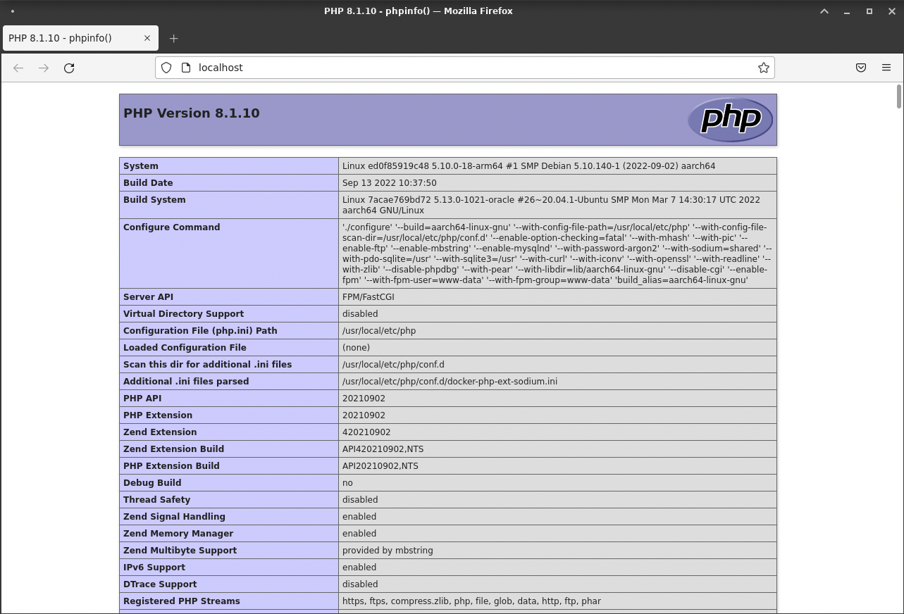

<!-- omit in toc -->
# UT3: Implantación de arquitecturas web

## 🐳 Instalación y configuración básica de un servidor web

<br>


**Nginx** se define como un **servidor web** / **proxy inverso** ligero y de alto rendimiento.


Optaremos por instalar Nginx en un sistema Linux, una opción muy popular hoy en día por su gratuidad. Nginx sobresale debido a:

- Su diseño modular y configurabilidad.
- Alto rendimiento.
Disponibilidad de extensiones y herramientas de terceros gracias a su código abierto.
- Integración en muchos stacks tecnológicos modernos.
- Disponibilidad en varios sistemas operativos como Windows, Linux y MacOS.
En el tema anterior, exploramos cómo Docker simplifica la instalación y configuración de servidores web sin afectar al sistema operativo principal, permitiendo múltiples versiones de un mismo servidor web en una máquina.

En este tema, aprenderemos a instalar Nginx directamente en Linux, utilizando una imagen base de Docker (ubuntu o debian), o una imagen Docker que ya contenga Nginx instalado (recomendado para producción).

### Instalación nativa. Opción 1

En la instalación nativa, todos los componentes se instalarán en el mismo servidor, como se ilustra en la imagen a continuación:


> 📝 **Datos importantes a recordar**:
> * nginx > ruta de instalación `/etc/nginx`<br>
> * nginx > fichero de configuración `/etc/nginx/nginx.conf`<br>
> * nginx > fichero configuración default `/etc/nginx/conf.d/default.conf`<br>
> * php-fpm > ruta de instalación `/etc/php/8.3/fpm`<br>
> * php-fpm > fichero configuración pool de procesos `/etc/php/8.3/fpm/pool.d/www.conf`<br>
> 
> *Reemplazar `8.3` por la versión de PHP instalada.*

Vamos a utilizar la versión base de Debian 11 (Bullseye) para instalar Nginx. 

```bash
# Damos el nombre nxnative al contenedor, ponemos como hostname (nombre servidor) srvnx, y posteriormente ejecutamos en modo interactivo
# Vinculamos el puerto 80 del contenedor con el puerto 80 del host
# --rm: Eliminar el contenedor cuando se detenga
# --hostname: Asignar nombre al servidor
# -it: Modo interactivo ==> y ejecutar bash (último parámetro)
docker run -it --rm --name nxnative -p 80:80 --hostname srvnx debian:bullseye-slim bash
```

- Al emplear la opción --rm, el contenedor se elimina al salir.

Una vez dentro del contenedor, procedemos a actualizar el sistema y prepararlo para la instalación de Nginx:

> 📝 **Guía-instalación**: <br>
> La guía de instalación de Nginx para Debian 11 (Bullseye) la podemos encontrar en la [página oficial](https://nginx.org/en/linux_packages.html#Debian) o para Ubuntu en la [página oficial](https://nginx.org/en/linux_packages.html#Ubuntu)


```bash
apt update && apt upgrade -y
# instalamos los paquetes necesarios para añadir repositorios externos
apt install -y curl gnupg2 ca-certificates lsb-release debian-archive-keyring
# Importamos la clave GPG del repositorio externo desde donde descargarnos la última versión de Nginx
curl -fsSL https://nginx.org/keys/nginx_signing.key | gpg --dearmor -o /etc/apt/trusted.gpg.d/nginx.gpg
# Añadimos el repositorio externo en cuestión y confirmamos que el repositorio está disponible tras actualizar las fuentes
echo "deb http://nginx.org/packages/debian $(lsb_release -sc) nginx" | tee /etc/apt/sources.list.d/nginx.list > /dev/null
# Actualizamos el sistema y lo dejamos preparado para instalar Nginx
apt update
# Instalamos Nginx
apt install -y nginx
```

Después de la instalación, podemos verificar la versión de Nginx instalada mediante el siguiente comando:

```bash
# -v para ver la versión, -V para ver la versión y los módulos instalados
nginx -V 
```

Podemos ver que el servicio está corriendo:

```bash
service nginx status
# Si no está corriendo, lo podemos levantar con:
service nginx start
```

> 💡 **Apagar y reconectar al servidor**:<br>
> Una vez fuera del contenedor (cuando este se detiene), no es necesario crearlo nuevamente. Simplemente lo iniciamos con docker start nxnative && docker exec -it nxnative bash para acceder a él. Además, es crucial reiniciar el servicio de Nginx con service nginx start, ya que al detener el contenedor, el servicio se detiene también.


Ahora podemos acceder a http://localhost desde el navegador del host, y veremos la página de bienvenida de Nginx:


### Instalación Nativa. Opción 2 (*Creación de un DockerFile para recrear la imagen*)

Vamos a redactar un Dockerfile para reconstruir la imagen de Nginx que hemos creado previamente, evitando así la necesidad de reinstalarlo cada vez que deseemos crear un contenedor con Nginx.


> 📝 **DockerFile**:<br>
> Necesitamos crear un archivo de texto con instrucciones para Docker, que automatice los pasos que hicimos antes, como una especie de "receta" para Docker.

```dockerfile
# Imagen base
FROM debian:bullseye-slim
RUN apt update && apt upgrade -y \
    && apt install -y curl gnupg2 ca-certificates lsb-release debian-archive-keyring \
    && curl -fsSL https://nginx.org/keys/nginx_signing.key | gpg --dearmor -o /etc/apt/trusted.gpg.d/nginx.gpg \
    && echo "deb http://nginx.org/packages/debian $(lsb_release -sc) nginx" | tee /etc/apt/sources.list.d/nginx.list > /dev/null \
    && apt update \
    && apt install -y nginx

# Exponemos el puerto 80
EXPOSE 80

# Ejecutamos nginx en primer plano, para evitar que el contenedor se pare
CMD ["/usr/sbin/nginx", "-g", "daemon off;"]
```

Guardamos el fichero como `dockerfile` (sin extensión) y lo construimos:

```bash
# Crea la imagen a partir del DockerFile, y le da el nombre sdf/nginx
docker build -t sdf/nginx .
```

Una podemos crear un contenedor a partir de la imagen que acabamos de crear. Podemos hacerlo de 2 formas:

1. Ejecutar en segundo plano, y conectarnos a posteriori:

    ```bash
    docker run -d --name nxnative -p 80:80 --hostname srvnx sdf/nginx
    docker exec -it nxnative bash
    ```
2. Ejecutar de forma interactiva y conectar a la vez que se crea el contenedor:

    ```bash
    docker run -it --name nxnative -p 80:80 --hostname srvnx sdf/nginx bash
    ```

Si más adelante necesitamos iniciar el contenedor, y volver a entrar:

```bash
docker start nxnative && docker exec -it nxnative bash
```

Ahora al igual que antes, podemos acceder a http://localhost y si todo funciona bien, podemos ver la página de bienvenida de Nginx.

## Servidores de aplicaciones

Un servidor de aplicaciones es un software que ofrece servicios a las aplicaciones, como seguridad, manejo de datos, transacciones, balanceo de carga y gestión de sistemas distribuidos.

Su funcionamiento depende de un servidor web, aunque a menudo se incluyen juntos, son componentes distintos.

Cuando un cliente solicita algo al servidor web, este se encarga de la gestión básica, pero puede haber aspectos para los cuales no esté preparado. Aquí es donde entra el servidor de aplicaciones, que asume ciertas responsabilidades del servidor web, como el manejo de tipos específicos de archivos.

A continuación, veremos cómo desplegar una aplicación PHP como ejemplo de servidor de aplicaciones.

### PHP nativo (Opción 1)

[PHP](https://www.php.net/) 
Es un lenguaje de "scripting" ampliamente utilizado en la programación web, aunque no exclusivamente, y facilita el desarrollo de aplicaciones integradas directamente en el código HTML.

El servidor de aplicación (o manejador de procesos) que se utiliza para PHP es [PHP-FPM](https://www.php.net/manual/es/install.fpm.php). Se encarga de manejar los procesos [FastCGI](https://es.wikipedia.org/wiki/FastCGI), un protocolo para interconectar programas interactivos con un servidor web.

Ambos software (Nginx y php) se instalan en el mismo servidor:


Para **instalar PHP-FPM** seguiremos los pasos indicados a continuación.

En primer lugar debemos instalar algunos **prerrequisitos**:

```bash
apt update
# Instalamos los paquetes necesarios para añadir repositorios externos:
apt install -y lsb-release ca-certificates apt-transport-https software-properties-common gnupg2
# Importamos la clave GPG del repositorio externo desde donde descargarnos la última versión de PHP-FPM:
curl -fsSL  https://packages.sury.org/php/apt.gpg | gpg --dearmor -o /etc/apt/trusted.gpg.d/sury.gpg
# Añadimos el repositorio externo en cuestión:
echo "deb https://packages.sury.org/php/ $(lsb_release -sc) main" | tee /etc/apt/sources.list.d/sury-php.list
# Confirmamos que el repositorio está disponible tras actualizar las fuentes:
apt update
```

Primero, veamos cómo podemos enfocar la búsqueda en los nombres de paquete que nos interesan:

```bash
:~$ apt-cache search --names-only 'php*-fpm'
php7.4-fpm - server-side, HTML-embedded scripting language (FPM-CGI binary)
php-fpm - server-side, HTML-embedded scripting language (FPM-CGI binary) (default)
php5.6-fpm - server-side, HTML-embedded scripting language (FPM-CGI binary)
php7.0-fpm - server-side, HTML-embedded scripting language (FPM-CGI binary)
php7.1-fpm - server-side, HTML-embedded scripting language (FPM-CGI binary)
php7.2-fpm - server-side, HTML-embedded scripting language (FPM-CGI binary)
php7.3-fpm - server-side, HTML-embedded scripting language (FPM-CGI binary)
php8.0-fpm - server-side, HTML-embedded scripting language (FPM-CGI binary)
php8.1-fpm - server-side, HTML-embedded scripting language (FPM-CGI binary)
php8.2-fpm - server-side, HTML-embedded scripting language (FPM-CGI binary)
php8.3-fpm - server-side, HTML-embedded scripting language (FPM-CGI binary)
```

Después de revisar la salida, notamos que la versión más reciente es la v8.3. Procederemos a instalar esa versión.

```bash
:~$ apt install -y php8.3-fpm
```

Dado que PHP-FPM se instala en el sistema como un **servicio**, podemos comprobar su estado utilizando `service`:

```bash
:~$ service php8.3-fpm status
# Después de instalarlo, el servicio está parado:
php8.3-fpm is not running ...failed!

# Lo iniciamos y comprobamos que está en ejecución:
:~$ service php8.3-fpm start
:~$ service php8.3-fpm status
php8.3-fpm is running ...done.
```

Con esta instalación, también hemos instalado el propio **intéprete PHP** para ejecutar programas:

```bash
:~$ php --version
PHP 8.3.0-dev (cli) (built: Sep 21 2021 10:22:20) ( NTS )
Copyright (c)
...
```
<!-- omit in toc -->
#### Habilitando PHP en Nginx

Nginx es un servidor web que puede servir archivos estáticos pero no puede interpretar ni ejecutar código escrito en PHP (o cualquier otro lenguaje dinámico). Por lo tanto, requerimos un procesador adicional, como PHP-FPM, para manejar y ejecutar el código PHP.

Lo primero que hay que hacer es permitir que el usuario `nginx` tenga acceso al [socket unix](https://es.wikipedia.org/wiki/Socket_Unix) que abre PHP-FPM. Para ello debemos editar la configuración de PHP-FPM:

> 💡 Instalar `nano`:<br>
>  Nano no está instalado por defecto en Debian 11, por lo que debemos instalarlo usarlo `apt install -y nano`..

```bash
:~$ nano /etc/php/8.3/fpm/pool.d/www.conf
```
Buscar las líneas en el fichero de configuración y cambiarlas por:
```ini
23| user = nginx
24| group = nginx
...
51| listen.owner = nginx
52| listen.group = nginx
```

Guardamos y **recargamos la configuración** de PHP-FPM:

```bash
:~$ service php8.3-fpm restart
```

Para **habilitar la comunicación entre Nginx y PHP-FPM** vamos a editar el siguiente fichero de configuración:

```bash
:~$ nano /etc/nginx/conf.d/default.conf
```

Buscar el bloque `location ~ \.php` y dejarlo así:

```nginx
location ~ \.php$ {
    root           /usr/share/nginx/html;
    fastcgi_pass   unix:/var/run/php/php8.3-fpm.sock;
    fastcgi_index  index.php;
    index          index.php;
    include        fastcgi_params;
    fastcgi_param  SCRIPT_FILENAME   $document_root$fastcgi_script_name;
}
```

Podemos comprobar que la **sintaxis del fichero de configuración** es correcta utilizando Nginx:

```bash
:~$ nginx -t
nginx: the configuration file /etc/nginx/nginx.conf syntax is ok
nginx: configuration file /etc/nginx/nginx.conf test is successful
```

Y reiniciamos el **servicio nginx** también:

```bash
:~$ service nginx restart
```

Una vez finalizado todo, y si todo está ok, podemos acceder a http://localhost/info.php y veremos la información de PHP:


> 💡 **¿Por qué no funciona?**:<br>
> Monitorizar un sistema es fundamental para comprobar si está funcionando y ver los errores.<br>
> En este caso, podemos ver los logs de Nginx en `/var/log/nginx/error.log` y los logs de PHP-FPM en `/var/log/php8.3-fpm.log`.<br>
> En el caso de PHP-FPM, podemos ver que el usuario `nginx` no tiene permisos para acceder al socket de PHP-FPM. Para solucionarlo, debemos editar el fichero `/etc/php/8.3/fpm/pool.d/www.conf` y cambiar el usuario y grupo de `nginx` a `www-data`.<br>
> Comandos para monitorizar el sistema:<br>
> - `tail -f /var/log/nginx/error.log` para ver los logs de Nginx en tiempo real.<br>

<!-- omit in toc -->
#### Primera aplicación web en PHP

Creamos un fichero PHP que contendrá un sencillo código mostrando la información de la instalación:

```bash
# Generar un fichero muy simple index.php con el contenido "<?php phpinfo(); ?>", y lo guarda en /usr/share/nginx/html/index.php. 
:~$ echo "<?php phpinfo(); ?>" | tee /usr/share/nginx/html/index.php
```

Abrimos un navegador en la ruta especificada `localhost/index.php` y veremos la información de PHP:


### PHP dockerizado (Opción 2)

Como vamos a poder comprobar, todo lo complejo y tedioso que ha sido instalar PHP-FPM en el sistema de forma manual, se simplifica enormemente con una imagen de Docker que ya tenga instalado PHP-FPM.

Para este escenario es necesario "componer" dos servicios, ya que mientras antes ambos servicios estaban instalados en el mismo ordenador, ahora vamos a tenerlos en dos contenedores diferentes:

- Nginx (`web`)
- PHP-FPM (`php-fpm`)


La estructura del "proyecto" quedaría así:

```bash
:~/UT3/EC/php-dockerizado$ tree
.
└── config
    └── default.conf
├── docker-compose.yml
└── src
    └── index.php
```

La composición de servicios en Docker se lleva a cabo mediante la herramienta [docker compose](https://docs.docker.com/compose/) usando un fichero de configuración en formato [yaml](https://es.wikipedia.org/wiki/YAML):

```yaml
version: "3.8"
name: ut3-ejercicio-php-dockerizado
services:
  web:
    image: nginx:1.25  # imagen oficial Nginx, versión 1.25
    container_name: nginx
    volumes:
      - ./src:/etc/nginx/html # "root" por defecto en Nginx
      - ./config/default.conf:/etc/nginx/conf.d/default.conf
    ports:
      - 8001:80

  php-fpm:
    image: php:8-fpm   # imagen oficial PHP que incorporar soporte para FPM
    container_name: php-fpm
    volumes:
      - ./src:/etc/nginx/html
```

Fichero de configuración del sitio web por defecto:

**`default.conf`**

```nginx
server {
  server_name _;
  index index.php index.html;

  location ~ \.php$ {
    fastcgi_pass php-fpm:9000;
    include fastcgi_params;  # fichero incluido en la instalación
    fastcgi_param SCRIPT_FILENAME $document_root$fastcgi_script_name;
  }
}
```

Y finalmente, nuestro programa PHP de prueba que mostrará por pantalla la configuración misma de PHP:

**`src/index.php`**

```nginx
<?php
  echo phpinfo();
?>
```

Con todo esto ya podemos levantar los servicios:

```bash
:~/dev/app$ docker compose up
[+] Running 3/0
 ⠿ Network app_default      Created                                                                                 0.0s
 ⠿ Container app-php-fpm-1  Created                                                                                 0.0s
 ⠿ Container app-web-1      Created                                                                                 0.0s
Attaching to app-php-fpm-1, app-web-1
php-fpm  | [21-Sep-2022 10:22:20] NOTICE: fpm is running, pid 1
php-fpm  | [21-Sep-2022 10:22:20] NOTICE: ready to handle connections
nginx      | /docker-entrypoint.sh: /docker-entrypoint.d/ is not empty, will attempt to perform configuration
nginx      | /docker-entrypoint.sh: Looking for shell scripts in /docker-entrypoint.d/
nginx      | /docker-entrypoint.sh: Launching /docker-entrypoint.d/10-listen-on-ipv6-by-default.sh
nginx      | 10-listen-on-ipv6-by-default.sh: info: Getting the checksum of /etc/nginx/conf.d/default.conf
nginx      | 10-listen-on-ipv6-by-default.sh: info: /etc/nginx/conf.d/default.conf differs from the packaged version
nginx      | /docker-entrypoint.sh: Launching /docker-entrypoint.d/20-envsubst-on-templates.sh
nginx      | /docker-entrypoint.sh: Launching /docker-entrypoint.d/30-tune-worker-processes.sh
nginx      | /docker-entrypoint.sh: Configuration complete; ready for start up
nginx      | 2022/09/21 10:22:20 [notice] 1#1: using the "epoll" event method
nginx      | 2022/09/21 10:22:20 [notice] 1#1: nginx/1.23.1
nginx      | 2022/09/21 10:22:20 [notice] 1#1: built by gcc 10.2.1 20210110 (Debian 10.2.1-6)
nginx      | 2022/09/21 10:22:20 [notice] 1#1: OS: Linux 5.10.0-18-arm64
nginx      | 2022/09/21 10:22:20 [notice] 1#1: getrlimit(RLIMIT_NOFILE): 1048576:1048576
nginx      | 2022/09/21 10:22:20 [notice] 1#1: start worker processes
nginx      | 2022/09/21 10:22:20 [notice] 1#1: start worker process 29
nginx      | 2022/09/21 10:22:20 [notice] 1#1: start worker process 30
```

> ⚠️ &nbsp;Si el comando anterior da un error de tipo "bind: address already in use" es posible que tengas Nginx nativo funcionando. Puedes pararlo con: `sudo systemctl stop nginx`.

Si dejamos este proceso corriendo y abrimos un navegador en http://localhost veremos la página de bienvenida de Nginx.


